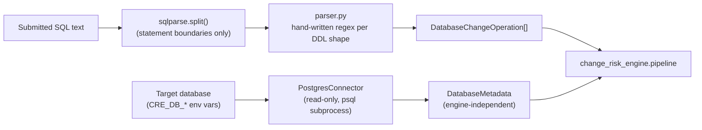

# Database change analysis

How a submitted SQL migration becomes structured `DatabaseChangeOperation`
facts, and how live database metadata is collected -- both read-only, both
auditable by construction.

## The SQL parser

`change_risk_engine/analyzers/database/parser.py`

Deliberately not a full SQL grammar. `sqlparse` is used for exactly one
thing -- safely splitting a migration file into statements around string
literals, dollar-quoted bodies, and comments (a genuinely hard problem
not worth re-solving by hand). Every statement is then matched against a
named, hand-written regular expression per DDL shape: `CREATE TABLE`,
`ALTER TABLE` (with its own sub-parser for `ADD COLUMN`, `DROP COLUMN`,
`ALTER COLUMN ... TYPE/SET/DROP DEFAULT/SET/DROP NOT NULL`, `RENAME
COLUMN`/`RENAME TO`, `ADD CONSTRAINT` incl. `FOREIGN KEY`/`PRIMARY KEY`,
`DROP CONSTRAINT`, `ATTACH`/`DETACH PARTITION`), `DROP TABLE`, `CREATE`/
`DROP INDEX` (incl. `CONCURRENTLY`), `CREATE`/`DROP`/`ALTER VIEW`,
`CREATE`/`DROP`/`ALTER FUNCTION`.

A multi-action `ALTER TABLE ... ADD COLUMN a int, DROP COLUMN b;` is
split into separate operations on top-level commas (not inside
parentheses or string literals -- see `_top_level_split`), so
`ADD CONSTRAINT ck CHECK (a > 0, b > 0)` doesn't get mis-split.

**Why this instead of a real SQL parser library**: every operation this
module produces traces to one named regex a reviewer can read in minutes.
A general SQL parser would be more complete but harder to audit for a
tool whose entire premise is explainability -- what "the parser found"
should match what a human reading the same statement finds. A statement
outside this vocabulary (or one this parser's patterns don't match)
becomes `DatabaseOperation.UNKNOWN`, not an error -- see
`docs/risk-model.md`'s confidence/uncertainty section for what happens to
it downstream. DML (`INSERT`/`UPDATE`/`SELECT`) is silently skipped, not
flagged -- a migration mixing DDL with a one-off backfill is normal, and
only the DDL is this analyzer's concern.

## The PostgreSQL metadata connector

`change_risk_engine/connectors/postgres/`

`PostgresConnector` implements `DatabaseConnector`
(`connectors/base.py`) -- the plugin interface every engine implements
(`get_metadata`, `get_table_statistics`, `get_indexes`,
`get_constraints`, `get_foreign_keys`, `get_view_dependencies`,
`get_query_statistics`). Oracle, MySQL, SQL Server, and Aurora PostgreSQL
are interface-only stubs (`connectors/stubs.py`) that raise
`NotImplementedError` naming exactly what needs implementing -- Aurora
PostgreSQL's real implementation will most likely subclass
`PostgresConnector` rather than reimplement catalog queries, since it's
wire-compatible.

**Read-only by construction, not just convention** (section 20 of the
product brief: "Never execute submitted SQL against a production
database"):

1. Every query runs inside `BEGIN TRANSACTION READ ONLY` with a 10s
   `statement_timeout`.
2. Every SQL string the connector sends is a fixed constant defined in
   `connectors/postgres/provider.py` -- 15 focused, independently
   reviewable queries against `pg_class`/`pg_attribute`/`pg_constraint`/
   `pg_index`/etc. Nothing here executes text derived from a submitted
   migration.
3. Identifiers (schema/table/view names, which *do* come from a parsed
   migration and must be treated as untrusted) never reach SQL text via
   string interpolation. They pass through `psql`'s `--set`/`:'var'`
   mechanism -- argv only, never a shell, never spliced into an
   identifier or `::regclass` cast -- and every query compares them
   against catalog text columns (`nspname`, `relname`) rather than
   building a dynamic identifier. `tests/unit/change_risk_engine/test_security.py`
   asserts a hostile identifier (`"public'; DROP TABLE customer; --"`)
   survives as one untouched argv element.
4. `DatabaseConnector` has no method that accepts a `sql: str` parameter
   -- enforced by a test, not just a docstring.

## Normalized metadata model

`change_risk_engine/metadata/models.py` -- `DatabaseMetadata` /
`SchemaMetadata` / `TableMetadata` / `ColumnMetadata` / `IndexMetadata` /
`ConstraintMetadata` / `ForeignKeyMetadata` / `ViewMetadata` /
`FunctionMetadata`. Every connector translates its native catalog into
these types; nothing above `change_risk_engine.connectors` ever branches
on "is this Postgres." Size fields are always bytes; count fields that
are only estimates say so in their name (`row_estimate`, never
`row_count`) -- PostgreSQL's own `pg_class.reltuples` is a planner
estimate, not an exact count, and this model never claims otherwise.

## What's verified, and what isn't

Following the same standard `dbre_platform`'s own README holds itself to
("What's simulated, and what's real"):

- **Real and verified in this build environment**: the SQL parser (unit
  tested against every DDL shape it supports, including the multi-action
  and hostile-identifier cases), the full pipeline (analyzer → dependency
  graph → blast radius → risk engine → policy engine → recommendations →
  report) running against hand-built `DatabaseMetadata` fixtures that
  mirror the exact shape `PostgresConnector.get_metadata()` returns, the
  REST API and CLI end to end, and the `FileAssessmentStore` persistence
  round-trip.
- **Written and reviewed carefully, but not exercised against a live
  PostgreSQL server in this build environment**: `PostgresConnector`'s 15
  catalog queries and `PostgresAssessmentStore`. This build environment
  has the PostgreSQL client tools (`psql`) but no reachable PostgreSQL
  server and no Docker daemon -- the same category of constraint this
  repository's own `docs/local-vs-aws.md` documents for AWS RDS. Every
  query was written against PostgreSQL 14-18 catalog documentation and is
  structurally simple (a handful of joins against `pg_catalog` views with
  no vendor-specific extensions assumed); running `cre analyze
  migration.sql --target-database <name>` (no `--demo`) against a real
  server is the natural first thing to verify in an environment that has
  one.
- **The demo path** (`cre demo`, `--demo` on any command) uses
  `change_risk_engine.demo.fixtures.build_demo_database_metadata()` --
  hand-built `DatabaseMetadata` for three fictional ACME Financial
  databases, standing in for a live connector exactly where the
  Docker-container-pull equivalent stands in for `dbre_platform`'s own
  local demo in this same build environment. See `docs/demo.md`.
