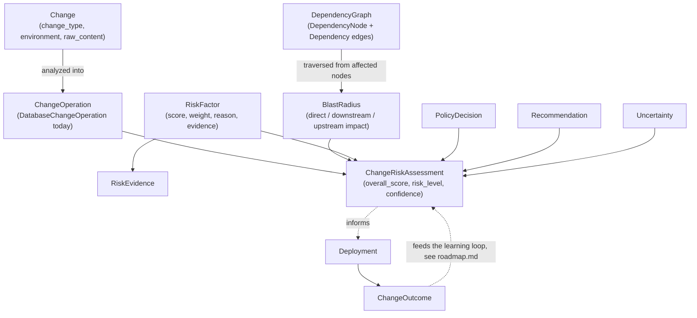

# Change Risk Engine: domain model

The core abstraction is `Change`, not `DatabaseChange` -- see
[ADR 0008](decisions/0008-change-risk-engine-domain-separation.md) and
[`docs/application-expansion.md`](application-expansion.md). Every type
below lives in `change_risk_engine.domain` and has no dependency on any
particular database engine, analyzer, or storage backend.

## `Change` and `ChangeOperation`

`change_risk_engine/domain/change.py`

`Change` is what gets submitted for assessment: raw content (SQL text
today), `change_type` (`ChangeType.DATABASE` is the only one with a
working analyzer), `source` (cli/api/web_ui/git_diff/pull_request/manual),
`environment`, and `target_database`. An analyzer populates
`Change.operations: list[ChangeOperation]` -- never the `Change` class
itself, which stays generic.

`ChangeOperation` is a base marker (`kind: str`); `DatabaseChangeOperation`
is the only concrete subclass today, carrying `operation`
(`DatabaseOperation` enum -- `ADD_COLUMN`, `DROP_TABLE`,
`CREATE_INDEX_CONCURRENTLY`, ... see `domain/enums.py` for the full list),
`schema`/`table`/`column`/`index`/`constraint`/`data_type`, and
`old_state`/`proposed_state` dicts holding whatever the parser could
determine. A future `ApplicationChangeOperation` or `ApiChangeOperation`
is additive: it implements the same base, and every downstream stage
(dependency discovery, blast radius, risk factors) that dispatches on
`operation.kind` grows a new branch without touching `Change` itself.

## `ChangeRiskAssessment`

`change_risk_engine/domain/risk.py`

The product's central output. Always carries, together, never as a bare
number:

| Field | What it is |
|---|---|
| `overall_score` / `risk_level` | 0-100 and LOW/MEDIUM/HIGH/CRITICAL (see `docs/risk-model.md`) |
| `confidence` | 0-1, reduced by unparseable statements, missing metadata, low-confidence dependency edges |
| `factors` | every `RiskFactor` that contributed, with its own score/weight/reason/evidence |
| `evidence` | the top contributing factors' evidence, rolled up |
| `blast_radius` | see below |
| `recommendations` | see `docs/risk-model.md`'s recommendation rules |
| `policy_decisions` | every policy rule evaluated, triggered or not |
| `uncertainty` | explicit gaps -- "not measured," never silently treated as "safe" |
| `explanation` | a plain-English narrative (`change_risk_engine.ai`), grounded in the fields above |

`RiskFactor.contribution` is always `score * weight` -- see
`docs/risk-model.md` for how the 13 implemented factors' weights are
loaded from `policies/risk/factor-weights.yaml`, never hard-coded.

## Dependency graph and blast radius

`change_risk_engine/domain/dependency.py`, `domain/blast_radius.py`

`DependencyNode` is one resource (table, view, service, API endpoint,
data pipeline, replication target, database). `Dependency` is a directed
edge: `A -> B` means "A depends on B." Every edge carries `source: DependencySource`
(`database_metadata` | `application_code` | `query_log` | `tracing` |
`manual` | `configuration` | `inferred`) and a `confidence` -- see
`docs/dependency-model.md` for how the graph is built and why an edge's
provenance is never collapsed into "just a dependency."

`BlastRadius` is the result of traversing that graph from a change's
directly affected resources: `direct_impact`, `downstream_impact` (what
depends on the changed resource -- what could break),
`upstream_dependencies` (what the changed resource itself depends on),
plus rollups (`affected_services`, `affected_apis`,
`affected_data_pipelines`, `critical_dependencies`) and an
`estimated_scope` (narrow/moderate/wide/extensive, a documented
heuristic -- see `docs/dependency-model.md`).

## Policy

`change_risk_engine/domain/policy.py`

`RiskPolicyRule` is one versioned, declarative rule (conditions + actions)
loaded from `policies/risk/rules/*.yaml`. `PolicyDecision` is the record
of evaluating one rule against one assessment: `triggered`, `severity`,
`actions_applied`. See `docs/policy-engine.md`.

## The learning loop foundation

`change_risk_engine/domain/deployment.py`

`Deployment` (when/where/by whom a change was deployed), `ChangeOutcome`
(what actually happened -- incidents, alerts, rollback, human override),
and `RiskOverride` (a human decision to proceed despite, or reject
despite, the assessment) exist so outcome data can start accumulating now.
Section 27 of the product brief is explicit: no ML-accuracy claim is made
until there's real historical data to compare predicted risk against
actual outcome -- see `docs/roadmap.md`.
